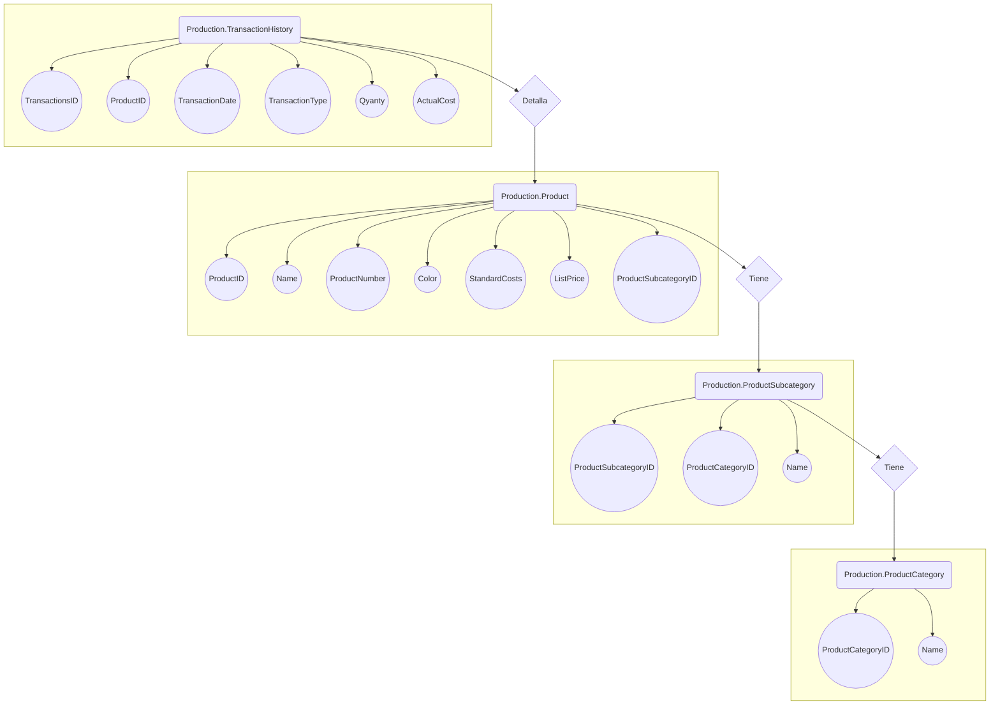

**# DataAnalytics**

_Integrantes_

| Id | Apellido | Nombre |
|------------- | ------------- | ------------- |
| 01 | Martinez|Juan 

<h3>Primera entrega 16/09.

## Descripción de la temática.
  - Este trabajo consiste en hacer una análisis de la base de datos suministrada por el curso. 
  En este caso se toma la tabla de Production.TransactionHistory para hacer una análisis del historial de ventas de acuerdo a los productos de la tabla Production.Product y las tablas Production.ProductCategory, Production.ProductSubcategory.
  En estas tablas no se toman todas las columnas para su análisis, si no las necesarias para relevar la información pertinente.
    
## Tipo de Análisis.
  - Se va analizar:
    - Cantidad de ventas realizadas por año.
    - Cantidad de ventas realizadas por mes. 
    - Las ganancias de las ventas por año/mes.     
    - Cantidad de productos vendidos, según subcategoría o categoría.
    - Diferencia de los períodos en cuanto a ventas y productos.
    
## Tablas utilizadas.
  - Production.TransactionHistory
  - Production.Product
  - Production.ProductCategory
  - Production.ProductSubcategory

## Diseño Tablas.
   - Production.TransactionHistory
        | ColumnName  | DataType |
        | ------------- | ------------- |
        | TransactionsID | int |
        | ProductID      |int  |
        | TransactionDate |datetime|
        |  TransactionType   |nchar(1)|
        |  Quanty   |int|
        |  ActualCost|money|
        
   - Production.Product
        | ColumnName | DataType |
        | ------------- | ------------- |
        |  ProductID | int |
        |  Name | nvarchar(50) |
        |  ProductNumber | nvarchar(25) |
        |  Color | nvarchar(15) |
        |  StandardCost | money |
        |  ListPrice | money |
        |  ProductSubcategoryID | int |
        
   - Production.ProductSubcategory
        | ColumnName  | DataType |
        | ------------- | ------------- |
        |ProductSubcategoryID|int|
        |ProductCategoryID|int|
        |Name|nvarchar(50)|
   - Production.ProductCategory
        | ColumnName  | DataType |
        | ------------- | ------------- |
        |ProductCategoryID|int|
        |Name|nvarchar(50)|

<h3>Segunda entrega 06/10.

  
## Diagrama Entidad Relación.

 
 
