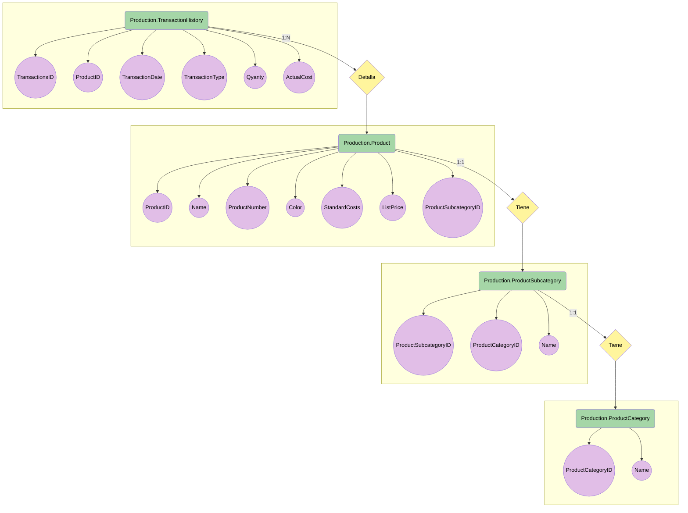
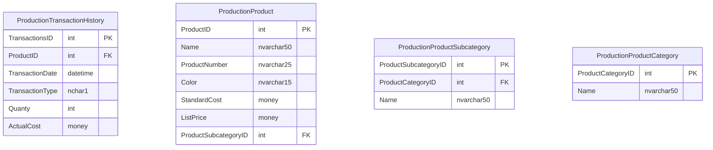

**# DataAnalytics**

_Integrantes_


| Id | Apellido | Nombre |
|------------- | ------------- | ------------- |
| 01 | Martinez|Juan 

<details>
<summary><h3>Primera entrega 18/10.</summary>
<p>

## Descripción de la temática.
  - Este trabajo consiste en hacer una análisis de la base de datos suministrada por el curso. 
  En este caso se toma la tabla de Production.TransactionHistory para hacer una análisis del historial de ventas de acuerdo a los productos de la tabla Production.Product y las tablas Production.ProductCategory, Production.ProductSubcategory.
  En estas tablas no se toman todas las columnas para su análisis, si no las necesarias para relevar la información pertinente.
    
## Tipo de Análisis.
  - Se va analizar:
    - Cantidad de ventas realizadas por año.
    - Cantidad de ventas realizadas por mes. 
    - Las ganancias de las ventas por año/mes.     
    - Cantidad de productos vendidos, según subcategoría o categoría.
    - Diferencia de los períodos en cuanto a ventas y productos.
    
## Tablas utilizadas.
  - Production.TransactionHistory
  - Production.Product
  - Production.ProductCategory
  - Production.ProductSubcategory

## Diseño Tablas.
   - Production.TransactionHistory
        | ColumnName  | DataType |
        | ------------- | ------------- |
        | TransactionsID | int |
        | ProductID      |int  |
        | TransactionDate |datetime|
        |  TransactionType   |nchar(1)|
        |  Quanty   |int|
        |  ActualCost|money|
        
   - Production.Product
        | ColumnName | DataType |
        | ------------- | ------------- |
        |  ProductID | int |
        |  Name | nvarchar(50) |
        |  ProductNumber | nvarchar(25) |
        |  Color | nvarchar(15) |
        |  StandardCost | money |
        |  ListPrice | money |
        |  ProductSubcategoryID | int |
        
   - Production.ProductSubcategory
        | ColumnName  | DataType |
        | ------------- | ------------- |
        |ProductSubcategoryID|int|
        |ProductCategoryID|int|
        |Name|nvarchar(50)|
   - Production.ProductCategory
        | ColumnName  | DataType |
        | ------------- | ------------- |
        |ProductCategoryID|int|
        |Name|nvarchar(50)|


</p>
</details>

<details>
<summary><h3>Segunda entrega 03/11.</summary>
<p>
 
## Objetivo del Proyecto.
- El objetivo de esta segunda entrega es difinir los diagrama de clases que vamos a utilizar para entender el dominio del problema y los datos que serán
	utilizados para la presentación en BI.
	
## Alcance.
- El alcance del proyecto es terminar haciendo un dashboard en power Bi haciendo un análisis de las ventas que tenemos en nuestro dataset, según ciertos KPIS
	difinidos en la primera entrega.
	
## Usuario final y nivel de aplicación del análisis.
- El proyecto sirve para aquellas personas que toman dicisiones sobre las ventas y los productos que se vende. Por lo tanto el usuario final de la presentación
	puede ser un generente de ventas o alguien mas operativo como un coordinador para saber que tiene que hacer foco. La aplicación que tiene el mismo
	es poder ver como fluctuan la cantidad de ventas por los periodos en cuestión y sobre los productos mas vendidos.
	
## Diagrama Entidad Relación.
- A continuación el diagrama

## Listado Tablas.
   - 
        | Production.TransactionHistory  |   |
        | ------------- | ------------- |
        | TransactionsID | PK |
        | ProductID      | FK  |
        | TransactionDate | |
        |  TransactionType   | |
        |  Quanty   | |
        |  ActualCost||
        
   - 
        | Production.Product | |
        | ------------- | ------------- |
        |  ProductID | PK |
        |  Name | |
        |  ProductNumber | |
        |  Color | |
        |  StandardCost | |
        |  ListPrice | |
        |  ProductSubcategoryID | FK |
        
   - 
        | Production.ProductSubcategory  | |
        | ------------- | ------------- |
        |ProductSubcategoryID| PK |
        |ProductCategoryID| FK |
        |Name| |
   - 
        | Production.ProductCategory  | |
        | ------------- | ------------- |
        |ProductCategoryID|PK|
        |Name| |


	
## Listado de columnas de cada tabla.



</p>
</details>

<details>
<summary><h3>Tercera entrega 08/12.</summary>
<p>
 
## Objetivo del la entrega.
- En esta entrega se solicita la confección de un dashboard en powerbi, junto a ciertas condiciones para su realización.
## Archivos
- Se cargaron todos los archivos
  - Querys
    - Se cargaron todos los archivos .sql que fueron utilizados.
  - Icosnos/imagenes
    - Se cargaron las imágenes e iconos que fueron utilizados.
  - Backup
    - Se subió el .bak para que se puedan levantar y ver los datos que hay dentro que fueron utilizados.
  - Tablero
    - Se subió el tablero generado .pbix .
## Transformaciones Realizadas
 - Base de datos
   - Se realizó un cast() a la columna de TransactionDate para pasarlo a date de datetime. 
   - Se realizó un _case when_ en la columna TransactionType para poder identificar que tipo de _order_ era.
   - Se realizó un cast() a decimal con solo dos lugares después de la coma de la columna ActualCost. 
   - Se realizó la creación de una columa nueva para identificar al precio final la transacción. se multiplica ActualCost por Quantity para obtener TotalPrice.
- Power Query
   - Se crearon las relaciones entre las distintas tablas para que quedara todo en una sola tabla TransactionHistory, se hizo combinar querys con el _inner join_ para buscar aquellos productos que tienen una subcategoria y categoria para poder realizar el análisis.
   - Se crearon 3 referencias de la tabla TransactionHistory, cada una con un filtro distinto para poder diferenciar que tipo de _order_ es, para así tener un análisis mas rápido y cálculos sencillos.
   - Se creó una columna nueva que extrae el año de la fecha de venta para realizar un cálculo mas sencillo.
- Power bi
   - Se creó automáticamente el modelo relacional después de crear las conexiones en power query.
	
## Medidas y Fórmulas
- Tablas
   - Se creó una tabla de Totales para utilizarla para medidas generales de diferentes _orders_.
- Medidas
   - La medida Profit sirve para saber la ganancias netas de la empresa.
    ```ruby
	VAR ventas =
	CALCULATE(
		SUM('Total'[TotalPrice]),
		'Total'[TransactionType] IN { "SalesOrder" }
	)
	VAR  compras = CALCULATE(
		SUM('Total'[TotalPrice]),
		'Total'[TransactionType] IN { "PurchaseOrder" }
	)
	VAR  trabajos = CALCULATE(
		SUM('Total'[TotalPrice]),
		'Total'[TransactionType] IN { "WorkOrder" }
	)
	RETURN
	(trabajos + ventas) - compras
    ```
  - La medida Product se calcula la cantidad de productos por _order_ por lo tanto se reemplaza la palabra clave (ejemplo WorkOrders). Por más que se use la función sum(), no suma porque la cantidad de valores es uno.
   ```ruby
	ProductWork = 
	CALCULATE(
		SUM('Total'[TotalProduct]),
		'Total'[TransactionType] IN { "WorkOrder" }
	)
   ```
  - La medida Price sirve para saber el monto total dependiendo de la _order_, se reemplaza la palabra clave (ejemplo WorkOrders). Por más que se use la función sum(), no suma porque la cantidad de valores es uno.
   ```ruby
	PriceWork = 
	CALCULATE(
		SUM('Total'[TotalPrice]),
		'Total'[TransactionType] IN { "WorkOrder" }
	)
   ```
  - La medida Porcentaje sirve para saber en porciento el rendimiento de la empresa de un año a otro dependiendo del _order_. Para saber de los otros hay que cambiar la tabla, donde dice WorkOrder van las otras que se hizo en power query (Los cálculos de los años son fijos pero se pueden hacer dinámicos utilizando una variable que tome la fecha actual y extrayendo el año).
   ```ruby
	PorcentajeWork = 
	VAR ventas14 =
	CALCULATE(
		SUM('WorkOrder'[TotalPrice]),
		'WorkOrder'[DateYear] IN { 2014 }
	)
	VAR  ventas13 = CALCULATE(
		SUM('WorkOrder'[TotalPrice]),
		'WorkOrder'[DateYear] IN { 2013 }
	)

	
	RETURN
	((ventas14-ventas13)/ventas13)
   ```

</p>
</details>

<details open>
<summary><h3>Entrega Final 22/12.</summary>
<p>
<div align="center">

<h4>Autor:Juan Martinez</h4>
<h4>Institución:Coderhouse</h4>
</div>
<h4>Empresa dedicada a la venta minorista y mayorista de bicicletas , con gran experiencia en el rubro de cada uno de sus integrantes.</h4>


## Indice
 1. Presentación del Proyecto 
    - <a href="#objetivo-del-proyecto-1">Objetivo del Proyecto</a>
    - <a href="#alcance-1">Alcance</a>
    - <a href="#usuario-final-y-nivel-de-aplicación-del-análisis-1">Usuario final y nivel de aplicación del análisis</a>
    - <a href="#descripción-de-la-temática-1">Descripción de la temática</a>
    - <a href="#tipo-de-análisis-1">Tipo de Análisis</a>
 2. Base de Datos  
    - <a href="#introducción">Introducción</a>
    - <a href="#tablas-utilizadas-1">Tablas utilizadas</a>
    - <a href="#listado-de-columnas-de-cada-tabla-1">Listado de columnas de cada tabla</a>
    - <a href="#diagrama-entidad-relación-1">Diagrama Entidad Relación</a>
    - <a href="#querys">Querys</a>
<div align="center" text-decoration= "underline">
<h1>Presentación del Proyecto
</div>
        
## Objetivo del Proyecto.
- El objetivo de este proyecto es plasmar en números para comprender el estado actual de la empresa. Tener la cantidad de ventas,compras y ordenes de compras para saber cuanto se generó o perdió en el transcunso del tiempo.
	
## Alcance.
- El alcance del proyecto es poder entender como está la empresa para poder tomar las deciones pertienen para cambiar el rumbo de la misma. 
	
## Usuario final y nivel de aplicación del análisis.
- El proyecto sirve para aquellas personas que toman dicisiones sobre las ventas y los productos que se vende. Por lo tanto el usuario final de la presentación
	puede ser un generente de ventas o alguien mas operativo como un coordinador para saber que tiene que hacer foco. La aplicación que tiene el mismo
	es poder ver como fluctuan la cantidad de ventas por los periodos en cuestión y sobre los productos mas vendidos.
## Descripción de la temática.
  - Este trabajo consiste en hacer una análisis de la base de datos suministrada. 
  En este caso se toma la tabla de Production.TransactionHistory para hacer una análisis del historial de ventas de acuerdo a los productos de la tabla Production.Product y las tablas Production.ProductCategory, Production.ProductSubcategory.
  En estas tablas no se toman todas las columnas para su análisis, si no las necesarias para relevar la información pertinente.
    
## Tipo de Análisis.
  - Se va analizar:
    - Cantidad de ventas realizadas por año.
    - Cantidad de ventas realizadas por mes. 
    - Las ganancias de las ventas por año/mes.     
    - Cantidad de productos vendidos, según subcategoría o categoría.
    - Diferencia de los períodos en cuanto a ventas y productos.

<div align="center" text-decoration= "underline">
<h1>Base de Datos
</div>        

## Introducción.
   - La <a href="https://github.com/JuanMZ96/DataAnalytics/blob/main/Backup/Curso.zip">base</a> utilizada es una presentada por el curso dee CoderHouse para poder prácticar, la misma contiene información acerca del negocio de una venta de bicicletas y artículos referidos a ella. La misma también se puede encontrar en la página ofical de Microsoft(https://learn.microsoft.com/en-us/sql/samples/adventureworks-install-configure?view=sql-server-ver16&tabs=ssms). 
     - Los datos de base no se usaron en tu totalidad, se usuaron solo la tabla de transacciones para poder ver el flujo de ventas, compras y ordenes de trabajo. Si bien tiene mas datos para analizar, acotamos el dominio para su uso, tanto la cantidad de tablas o la cantidad de columnas de cada tabla utilizada.
        
## Tablas utilizadas.
  - Production.TransactionHistory
  - Production.Product
  - Production.ProductCategory
  - Production.ProductSubcategory

## Listado de columnas de cada tabla.


## Diagrama Entidad Relación.
- A continuación el diagrama

## Querys
 - <a href="https://github.com/JuanMZ96/DataAnalytics/blob/main/Query/TransactionHistory.sql">Production.TransactionHistory</a>
   - Se realizó un cast() a la columna de TransactionDate para pasarlo a date de datetime. 
   - Se realizó un _case when_ en la columna TransactionType para poder identificar que tipo de _order_ era.
   - Se realizó el cálculo de TotalPrice que se obtiene al múltiplica el costo actual por la cantidad del elemento.
   - En ambos casos de número se dejó solamente dos lugares después de la coma.
   ```ruby
	SELECT    
	tra.TransactionID
	,CAST(tra.TransactionDate AS date) AS SalesDate
	,tra.ProductID
	,case when tra.TransactionType like 'W' then 'WorkOrder'
		when tra.TransactionType like 'S' then 'SalesOrder'
		when tra.TransactionType like 'P' then 'PurchaseOrder' end as 'TransactionType'
	, tra.Quantity
	,CAST(tra.ActualCost AS decimal(10, 2)) AS Price
	,CAST(tra.ActualCost AS decimal(10, 2)) * tra.Quantity AS TotalPrice

	FROM  Production.TransactionHistory AS tra 
   ```
        
 - Production.Product
   ```ruby
      	SELECT [ProductID]
      	,[Name]
      	,[ProductNumber]
      	,[Color]    
      	,[StandardCost]
      	,[ListPrice]
      	,[ProductSubcategoryID]
	FROM [Curso].[Production].[Product]
   ```    
 - Production.ProductSubcategory	
   ```ruby 
	SELECT [ProductSubcategoryID]
      	,[ProductCategoryID]
      	,[Name]
  	FROM [Curso].[Production].[ProductSubcategory]	
   ```   
 - Production.ProductCategory
   ```ruby 	
	SELECT [ProductCategoryID]
      	,[Name]
  	FROM [Curso].[Production].[ProductCategory]
   ```     
<div align="center" text-decoration= "underline">
<h1>Power Bi
</div>   	
 
## Introucción
   - El tablero creado muestra un resumen de los dos años de datos(2013 y 2014) seleccionados para el análisis en donde se puede ver en detalle los generado, lo comprado y lo realizado de los distintos tipos de productos, se encuentra segmentado a las 4 ramas principales y luego los subgrupos de los mismos.
## Objetivo
   - El objetivo del mismo es poder ver los información presentada para la toma de decisiones y el furuto de cada área involucrada en los distintos procesos.
## Áreas
   - La principal área enfocada el tableros es la generencia de cada proceso, tanto ventas y compras como producción.
## Transformaciones Realizadas
- Power Query
   - Se crearon las relaciones entre las distintas tablas para que quedara todo en una sola tabla TransactionHistory, se hizo combinar querys con el _inner join_ para buscar aquellos productos que tienen una subcategoria y categoria para poder realizar el análisis.
   - Se crearon 3 referencias de la tabla TransactionHistory, cada una con un filtro distinto para poder diferenciar que tipo de _order_ es, para así tener un análisis mas rápido y cálculos sencillos.
   - Se creó una columna nueva que extrae el año de la fecha de venta para realizar un cálculo mas sencillo en las columnas previamente mencionadas.
- Power bi
   - Se creó automáticamente el modelo relacional después de crear las conexiones en power query.
## Diagrama de entidad y relación
   - Se puede observar todas las tablas creadas por power query y las columnas nuevas como _DateYear_ en las tablas nuevas 
	<div align="center">
     	
     	</div>
## Medidas y Fórmulas
- Tablas
   - Se creó una tabla de Totales para utilizarla para medidas generales de diferentes _orders_.
- Medidas
   - La medida Profit sirve para saber la ganancias netas de la empresa.
    ```ruby
	VAR ventas =
	CALCULATE(
		SUM('Total'[TotalPrice]),
		'Total'[TransactionType] IN { "SalesOrder" }
	)
	VAR  compras = CALCULATE(
		SUM('Total'[TotalPrice]),
		'Total'[TransactionType] IN { "PurchaseOrder" }
	)
	VAR  trabajos = CALCULATE(
		SUM('Total'[TotalPrice]),
		'Total'[TransactionType] IN { "WorkOrder" }
	)
	RETURN
	(trabajos + ventas) - compras
    ```
  - La medida Product se calcula la cantidad de productos por _order_ por lo tanto se reemplaza la palabra clave (ejemplo WorkOrders). Por más que se use la función sum(), no suma porque la cantidad de valores es uno.
   ```ruby
	ProductWork = 
	CALCULATE(
		SUM('Total'[TotalProduct]),
		'Total'[TransactionType] IN { "WorkOrder" }
	)
   ```
  - La medida Price sirve para saber el monto total dependiendo de la _order_, se reemplaza la palabra clave (ejemplo WorkOrders). Por más que se use la función sum(), no suma porque la cantidad de valores es uno.
   ```ruby
	PriceWork = 
	CALCULATE(
		SUM('Total'[TotalPrice]),
		'Total'[TransactionType] IN { "WorkOrder" }
	)
   ```
  - La medida Porcentaje sirve para saber en porciento el rendimiento de la empresa de un año a otro dependiendo del _order_. Para saber de los otros hay que cambiar la tabla, donde dice WorkOrder van las otras que se hizo en power query (Los cálculos de los años son fijos pero se pueden hacer dinámicos utilizando una variable que tome la fecha actual y extrayendo el año).
   ```ruby
	PorcentajeWork = 
	VAR ventas14 =
	CALCULATE(
		SUM('WorkOrder'[TotalPrice]),
		'WorkOrder'[DateYear] IN { 2014 }
	)
	VAR  ventas13 = CALCULATE(
		SUM('WorkOrder'[TotalPrice]),
		'WorkOrder'[DateYear] IN { 2013 }
	)

	
	RETURN
	((ventas14-ventas13)/ventas13)
   ```

## Solapas
   - Portada
     - Se puede ver la presentación del logo de la empesa y cuatro botones para que navegar entre las distintas solapas con información 
	<div align="center">
     	
     	</div>

   - Resume
     - En esta solapa tenemos un resumen de números bastante claro de lo que fue la cantidad de proudctos vendidos,comprados y fabricados. 
     - El profit generado entre las ventas y productos fabricados.
     - Un histograma de los distintos tipos de transacciónes con las cantidades de las mismas sobre los años de información.
     - Una participación de las distinas categorías que se pueden filtrar por el tipo de transacción.
     - Un ranking de las subcategorías que mas cantidad de transacciones tuvieron 
	<div align="center">
     	
     	</div>
   - SalesOrder
     - Se puede observar todas las tablas creadas por power query y las columnas nuevas como _DateYear_ en las tablas nuevas 
	<div align="center">
     	
     	</div>
   - PurchaseOrder
     - Se puede observar todas las tablas creadas por power query y las columnas nuevas como _DateYear_ en las tablas nuevas 
	<div align="center">
     	
     	</div>
   - WorkOrder
     - Se puede observar todas las tablas creadas por power query y las columnas nuevas como _DateYear_ en las tablas nuevas 
	<div align="center">
     	
     	</div>
## Mejoras
  - Algo
</p>
</details>


 
 
