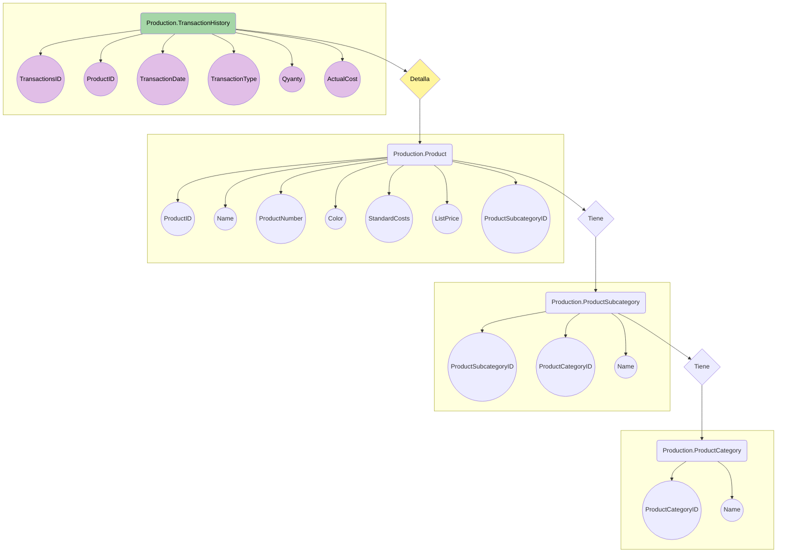

**# DataAnalytics**

_Integrantes_

| Id | Apellido | Nombre |
|------------- | ------------- | ------------- |
| 01 | Martinez|Juan 

<h3>Primera entrega 18/10.

## Descripción de la temática.
  - Este trabajo consiste en hacer una análisis de la base de datos suministrada por el curso. 
  En este caso se toma la tabla de Production.TransactionHistory para hacer una análisis del historial de ventas de acuerdo a los productos de la tabla Production.Product y las tablas Production.ProductCategory, Production.ProductSubcategory.
  En estas tablas no se toman todas las columnas para su análisis, si no las necesarias para relevar la información pertinente.
    
## Tipo de Análisis.
  - Se va analizar:
    - Cantidad de ventas realizadas por año.
    - Cantidad de ventas realizadas por mes. 
    - Las ganancias de las ventas por año/mes.     
    - Cantidad de productos vendidos, según subcategoría o categoría.
    - Diferencia de los períodos en cuanto a ventas y productos.
    
## Tablas utilizadas.
  - Production.TransactionHistory
  - Production.Product
  - Production.ProductCategory
  - Production.ProductSubcategory

## Diseño Tablas.
   - Production.TransactionHistory
        | ColumnName  | DataType |
        | ------------- | ------------- |
        | TransactionsID | int |
        | ProductID      |int  |
        | TransactionDate |datetime|
        |  TransactionType   |nchar(1)|
        |  Quanty   |int|
        |  ActualCost|money|
        
   - Production.Product
        | ColumnName | DataType |
        | ------------- | ------------- |
        |  ProductID | int |
        |  Name | nvarchar(50) |
        |  ProductNumber | nvarchar(25) |
        |  Color | nvarchar(15) |
        |  StandardCost | money |
        |  ListPrice | money |
        |  ProductSubcategoryID | int |
        
   - Production.ProductSubcategory
        | ColumnName  | DataType |
        | ------------- | ------------- |
        |ProductSubcategoryID|int|
        |ProductCategoryID|int|
        |Name|nvarchar(50)|
   - Production.ProductCategory
        | ColumnName  | DataType |
        | ------------- | ------------- |
        |ProductCategoryID|int|
        |Name|nvarchar(50)|

<h3>Segunda entrega 03/11.

 
## Objetivo del Proyecto.
- El objetivo de esta segunda entrega es difinir los diagrama de clases que vamos a utilizar para entender el dominio del problema y los datos que serán
	utilizados para la presentación en BI.
	
## Alcance.
- El alcance del proyecto es terminar haciendo una presentación en power Bi según los datos de nuestro dataset.
	
## Usuario final y nivel de aplicación del análisis.
- El proyecto sirve para aquellas personas que toman dicisiones sobre las ventas y los productos que se vende. Por lo tanto el usuario final de la presentación
	puede ser un generente de ventas o alguien mas mas operativo como un coordinador para saber que tiene que hacer foco. La aplicación que tiene el mismo
	es poder ver como fluctuan la cantidad de ventas por los periodos en cuestión y sobre los productos mas vendidos.
	
## Diagrama Entidad Relación.

 
 
